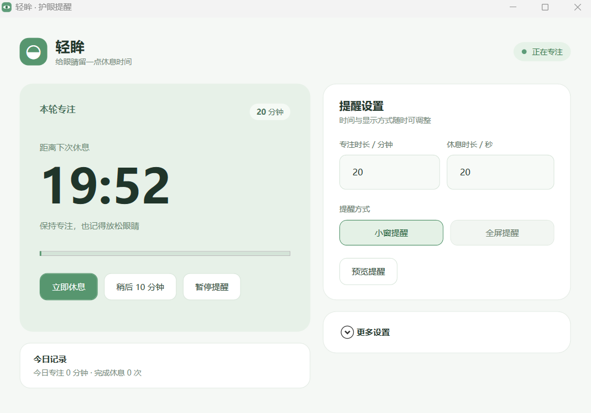

# 轻眸（QingMou）

轻眸是一款面向 Windows 的护眼休息提醒应用。它在系统托盘后台计时，到时间后提醒你暂时离开屏幕、看看远处。

## 界面预览



## 功能

- 自定义专注时长和休息时长。
- 选择右下角小窗提醒或全屏提醒。小窗显示 4 秒后自动关闭，不显示休息倒计时，也不会打开主窗口；后台仍会按设定时长完成休息。全屏提醒覆盖所有显示器并显示倒计时。
- 提醒时可以稍后提醒或跳过本次。主窗口里的“稍后”每轮只生效一次，避免重复点击不断推迟。
- 离开电脑或锁屏时暂停计时；可选择在全屏应用运行时暂缓提醒。
- 可选提示音、长休息、免打扰时段和登录 Windows 后自动启动。
- 设置和今日统计只保存在本机，不需要账号或网络连接。

## 使用

从 [Releases](https://github.com/wyhxffyo-web/qingmou-windows/releases) 下载 `QingMou-Windows-x64.zip`，解压后双击 `QingMou.exe`。此版本为 Windows x64 自包含发布，无需另装 .NET，也无需管理员权限。

首次运行时，可以选择“一键启用推荐设置”，或暂不开机启动直接使用。关闭主窗口后，轻眸会继续在系统托盘运行；右键托盘图标可重新打开、暂停提醒、立即休息或退出。

“更多设置”中的选项说明：

- **使用全屏软件时暂缓提醒**：看视频或玩游戏时不打断，退出全屏后再提醒。
- **离开电脑时暂停计时**：鼠标和键盘 5 分钟没有操作时暂停，回来后继续。
- **稍后多久再提醒**：设置点击“稍后”后等待的分钟数。
- **定期安排长休息**：每完成指定轮数的专注后，安排一次长休息。
- **指定时间不提醒**：在设定时段暂停提醒和专注计时，支持跨午夜。

设置保存在 `%APPDATA%\QingMou\settings.json`。

## 从源码构建

需要 Windows 和 [.NET 10 SDK](https://dotnet.microsoft.com/download/dotnet/10.0)。在项目目录运行：

```powershell
dotnet build .\QingMou.csproj -c Release
dotnet publish .\QingMou.csproj -c Release -r win-x64 --self-contained true -p:PublishSingleFile=true -p:IncludeNativeLibrariesForSelfExtract=true -o .\dist
```

发布目录中的 `QingMou.exe` 可以独立运行。应用使用 WPF 构建，系统托盘和显示器信息通过 Windows 桌面 API 提供。
